<h1 align="center">
  🚀 NextStep.io
</h1>

<p align="center">
  <strong>Your AI-Powered Career Companion</strong>
</p>

<p align="center">
  Transform resumes and transcripts into actionable career insights, immersive 3D visualizations, and personalized growth paths.

```mermaid
flowchart LR
  %% Upload & Authentication
  A[📄 Upload Resume/Transcript] --> B[🤖 AI Skill Extraction - Gemini & Vertex AI]
  A --> G[🔑 User Authentication - Clerk]

  %% Career Recommendation & Visualization
  B --> C[🧭 Career Recommendation Engine]
  C --> D[🌐 3D Career Path Visualization - Three.js]
  D --> E[📊 Dashboard & Interaction]
  
  %% Database & Automation
  C --> H[💾 Database Update - Postgres & Prisma]
  H --> I[⚡ Serverless Workflow Trigger - Inngest]
  I --> F[📧 Automated Email Reports - Resend]

  %% Link AI insights to notifications
  C --> F

  %% Style nodes with enhanced colors
  style A fill:#e0f7fa,stroke:#00acc1,stroke-width:2px,stroke-dasharray: 5 3
  style B fill:#f1f8e9,stroke:#7cb342,stroke-width:2px
  style C fill:#fff9c4,stroke:#fdd835,stroke-width:2px
  style D fill:#ede7f6,stroke:#5e35b1,stroke-width:2px
  style E fill:#f3e5f5,stroke:#ab47bc,stroke-width:2px
  style F fill:#ffebee,stroke:#e53935,stroke-width:2px
  style G fill:#e3f2fd,stroke:#1e88e5,stroke-width:2px
  style H fill:#fff3e0,stroke:#fb8c00,stroke-width:2px
  style I fill:#e0f2f1,stroke:#26a69a,stroke-width:2px
```

</p> ⚡ App Workflow


⚡ Installation & Setup

```bash
# Clone the repository
git clone https://github.com/yourusername/NextStep.io.git

# Navigate to the project directory
cd NextStep.io

# Install dependencies
npm install

# Run the development server
npm run dev
